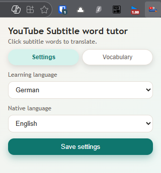
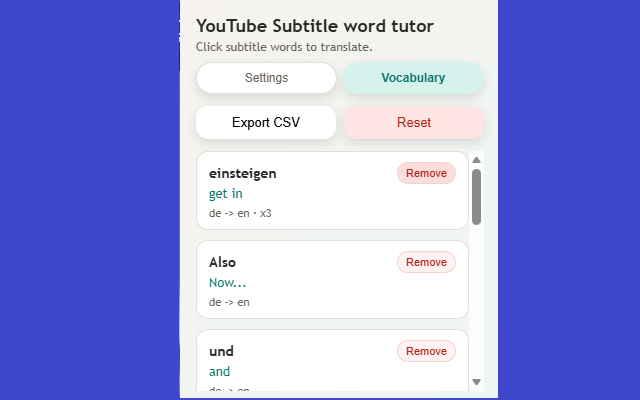

# YouTube Subtitle word tutor

A simple browser extension that lets you click YouTube subtitle words to translate them, save vocabulary, and export to Anki.

## Setup

1. Install dependencies:

```bash
npm install
```

2. Build the extension:

```bash
npm run build
```

3. Load the `dist` folder as an unpacked extension in Chrome:

- Go to `chrome://extensions`
- Enable **Developer mode**
- Click **Load unpacked**
- Select the `dist` folder

## Usage

- Open the extension popup to choose your learning and native languages.
- Turn on subtitles in a YouTube video.
- Click any subtitle word to see a translation bubble.
- Open the **Vocabulary** tab to export CSV or reset the list.

## Export to Anki

The exported CSV has two columns: word, translation (no header).

1. In the extension popup, go to **Vocabulary** and click **Export CSV**.
2. Open Anki: https://apps.ankiweb.net/
3. In Anki, go to **File > Import**, choose the downloaded CSV.
4. In the import options:
   - Note type: **Basic**
   - Fields separated by: **Comma**
   - Map **Field 1** to front (word) and **Field 2** to back (translation)
   - Pick or create a deck
5. Click **Import**.

## Demo



